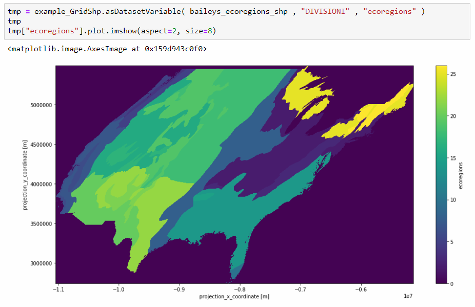
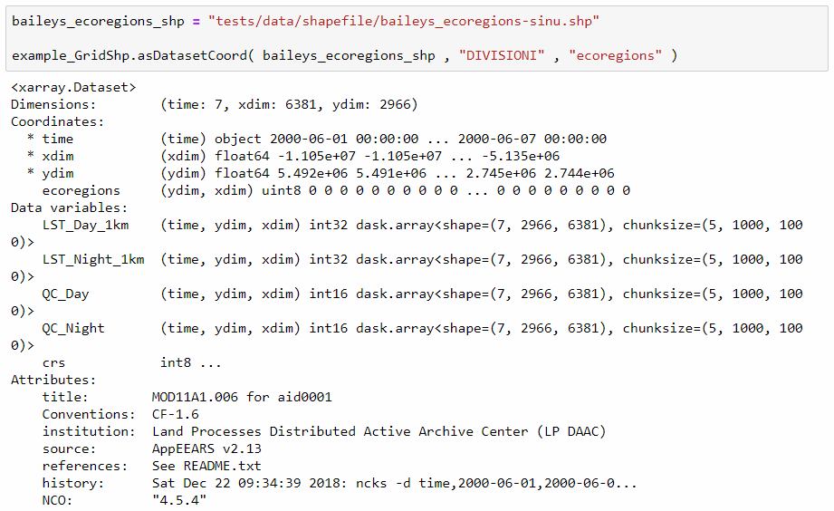

# extendXarray
Provides higher level functionality to the Python xarray project by integrating methods from GDAL and OGR.

The goal of this project is to provide simple functions for integrating vector processing tools available in GDAL/OGR with n-dimensional array processing capabilities of `xarray` and other members of the pydata.org environment. 

### Why? 

This project gives a set of GDAL/OGR vector processing functions on top of `xarray` (use for shapefile masking, zonal statistics, regional weighting, etc.)

### Status

Just one class for rasterizing shapefiles (other polygons soon) against input `xarray.Dataset` objects with methods for returning convenient `xarray` and `numpy` data structures.

See demo in the Jupyter Notebook:
[examples_GridShp.ipynb](examples_GridShp.ipynb)

------------------------------------

*Jupyter Notebook example of using `GridShp.asDatasetVariable()` to rasterize a shapefile and add the array to the input dataset as a new variable:*


------------------------------------

*Jupyter Notebook example of using `GridShp.asDatasetCoords()` to rasterize a shapefile and add the array to the input dataset as a new coordinate variable:*


#### GridShp()

```
class GridShp(object):
    
    # ----------------------------------------------------------------------------------------------
    # object: create empty gdal raster layer in memory that matches input xarray.Dataset
    #         dimensions. also, keep some spatial metadata in output class object.
    
    def __init__( self , _nc , _xdim , _ydim ):
        
        ##### check the three inputs: xarray.Dataset, x dimension name (string), y dimension name (string)
        
        # check xarray.Dataset
        if type(_nc) != xarray.core.dataset.Dataset: raise ValueError("Argument 1 isn't an xarray.Dataset")
        else: self.nc = _nc

        # check x and y dimension names
        try: self.xdim , self.ydim = _nc[ _xdim ] , _nc[ _ydim ]
        except ValueError as err:
            print("One or both of the dimensions supplied in arguments 2 and 3 aren't in the input xarray.Dataset.")
            raise
        
        ##### get spatial metadata from input xarray.Dataset
        
        self.ncols = self.xdim.size
        self.nrows = self.ydim.size
        self.ymax = max( self.ydim )
        self.ymin = min( self.ydim )
        self.xmax = max( self.xdim )
        self.xmin = min( self.xdim )
        self.yres = ( self.ymax - self.ymin ) / float( self.nrows )
        self.xres = ( self.xmax - self.xmin ) / float( self.ncols )
        self.geotransform = ( self.xmin , self.xres , 0 , self.ymax , 0 , -self.yres )
        
        ##### open empty raster object (GDAL)
        
        self.dst_ds = gdal.GetDriverByName( 'MEM' ).Create( '' , self.ncols , self.nrows , 1 , gdal.GDT_Byte )   
        self.dst_rb = self.dst_ds.GetRasterBand( 1 )     # get band as array
        self.dst_rb.Fill( 0 )                            # init with zeros
        self.dst_rb.SetNoDataValue( 0 )                  # set nodata value
        self.dst_ds.SetGeoTransform( self.geotransform ) # set geotransform
    
    # ----------------------------------------------------------------------------------------------
    # function (called internally) by class methods below. rasterizes shp against class object grid
    
    def _rasterizer( self, _dst , _shp , _burn ):
        
        shp = ogr.Open( _shp )
        
        if type( _burn ) == int: err = gdal.RasterizeLayer(_dst, [1], shp.GetLayer(), burn_values=[_burn])
        else: err = gdal.RasterizeLayer(_dst, [1], shp.GetLayer(), options=["ATTRIBUTE=%s" % _burn])
            
        return(_dst.GetRasterBand(1).ReadAsArray())
    
    # ----------------------------------------------------------------------------------------------
    # rasterize a shp within the class object grid. output in several formats. self-explanatory.
    
    
    def asNumpyArray( self , _shp , _burn ):
        
        return( self._rasterizer( self.dst_ds , _shp , _burn ) )
    
    
    def asDataArray( self , _shp , _burn ):

        return(xarray.DataArray(
            self._rasterizer( self.dst_ds , _shp , _burn ),
            coords = [ self.ydim , self.xdim ],
            dims = [ self.ydim.name , self.xdim.name ]
        ))
    
    
    def asDatasetCoord( self , _shp , _burn , _name , **kwargs ):

        _attrs = kwargs.get('attrs', dict())
        
        tmpnc = self.nc.copy()
        tmpnc.coords[ _name ] = xarray.DataArray(
            self._rasterizer( self.dst_ds , _shp , _burn ),
            coords = [ self.ydim , self.xdim ],
            dims = [ self.ydim.name , self.xdim.name ],
            attrs = _attrs
        )
        
        return(tmpnc)
    
    
    def asDatasetVariable( self , _shp , _burn , _name , **kwargs ):

        _attrs = kwargs.get('attrs', dict())
        
        tmpnc = self.nc.copy()
        tmpnc[ _name ] = xarray.DataArray(
            self._rasterizer( self.dst_ds , _shp , _burn ),
            coords = [ self.ydim , self.xdim ],
            dims = [ self.ydim.name , self.xdim.name ],
            attrs = _attrs
        )
        
        return(tmpnc)

```
